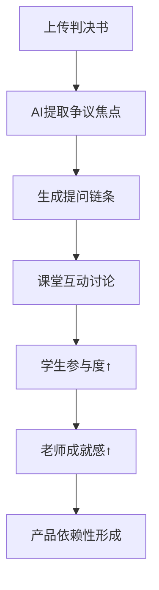
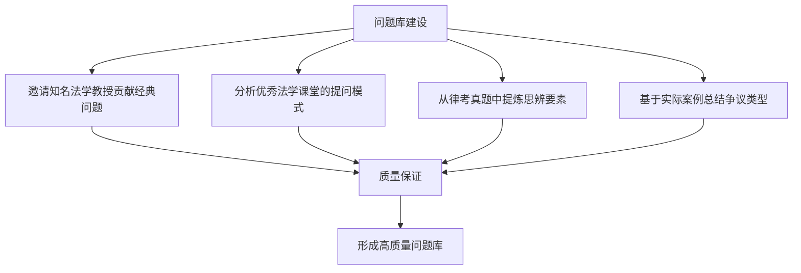

# MVP设计深度分析：苏格拉底式问答与争议焦点讨论

## 对话背景
**时间**：2025年8月21日  
**主题**：探讨以苏格拉底式问答和争议焦点讨论作为MVP核心功能  
**参与者**：用户与苏力教授角色

---

## 一、MVP核心洞察：抓住了真正的痛点

### 🎯 两个核心痛点

#### 痛点一：老师不知道怎么问问题
```
现实场景：
老师："同学们，你们对这个判决有什么看法？"
学生：（沉默）
老师：（尴尬）"那我们继续看下一个案例..."

问题本质：
- 缺乏系统的提问方法论
- 不知道如何引导学生思考
- 问题设计缺乏层次性
```

#### 痛点二：学生缺乏思辨训练
```
传统模式：
老师讲 → 学生记 → 考试背 → 毕业忘

缺少的环节：
- 独立思考
- 观点碰撞
- 批判性分析
- 价值判断
```

---

## 二、MVP设计的精妙之处

### 💡 核心流程设计



### 🚀 设计优势分析

#### 1. 需求刚性强
- 解决的是老师的**核心工作**，不是边缘需求
- 每节课都需要提问和讨论
- 直接影响教学效果和学生评价

#### 2. 技术壁垒适中
- **判决书解析**：有一定技术门槛，但不是不可攻克
- **问题生成**：基于GPT-4已经可以做得很好
- **实时互动**：现有技术完全支持

#### 3. 效果立竿见影
第一次使用老师就能感受到：
- 备课时间从2小时缩短到30分钟
- 学生参与度明显提升
- 课堂不再出现尴尬的沉默

#### 4. 可扩展性强
```
MVP阶段：判决书 + 问答
扩展方向：
├── 加入动画演示
├── 增加证据分析
├── 连接法条库
├── 对接考试系统
└── 建立案例库
```

---

## 三、苏力教授的关键提醒

### ⚠️ 提醒一：苏格拉底式问答的"坑"

#### 问题质量的差异
```
坏问题："你觉得这个判决对吗？"
- 导向主观评价
- 缺乏思维训练价值
- 容易陷入空洞讨论

好问题："如果你是原告律师，你会如何攻击这个证据链的薄弱环节？"
- 训练法律思维
- 需要具体分析
- 培养实务能力
```

#### 解决方案：问题库分层设计
- **事实层**：发生了什么？
- **规则层**：适用什么法律？  
- **价值层**：体现什么冲突？
- **假设层**：如果情况不同会怎样？

### ⚠️ 提醒二：争议焦点不等于教学重点

#### 认知差异
```
法官关注：这个案子怎么判？（个案处理）
学生需要：这类问题怎么思考？（思维训练）
```

#### 建议改进
AI不能只提取**个案争议**，还要识别**类型化问题**：
- 这是合同纠纷的典型争议点吗？
- 这个推理模式在其他案例中如何运用？
- 这背后体现了什么法理原则？

### ⚠️ 提醒三：缺少"落地环节"

#### 现有流程的不足
```
现在：提问 → 讨论 → 结束
缺少：思维固化 + 能力检验
```

#### 建议增加
- 学生观点的**结构化记录**
- 讨论结果的**理论提升**
- 类似案例的**举一反三**

---

## 四、优化后的MVP功能设计

### 🎯 功能一：智能争议焦点提取

```yaml
输入：判决书PDF
输出：
  争议焦点清单：3-5个核心问题
  每个焦点包含：
    - 背景说明
    - 相关法条
    - 理论要点
    - 类似案例推荐
```

### 🎯 功能二：分层问题链生成

```yaml
每个争议焦点生成：
  引入问题：激发兴趣，引起关注
  事实问题：澄清细节，理解案情
  规则问题：法条理解，规范适用
  价值问题：深度思辨，价值衡量
  假设问题：举一反三，能力迁移
```

### 🎯 功能三：实时讨论管理

```yaml
课堂功能：
  交互功能：
    - 匿名观点投票
    - 论据收集展示
    - 观点变化追踪
  管理功能：
    - 讨论时间管理
    - 核心观点记录
    - 参与度统计
```

---

## 五、问题库质量：成败的关键

### 🔑 问题设计的三个标准

#### 1. 启发性
- 能引发学生思考，而非背诵
- 激发好奇心和探索欲
- 有开放性和讨论空间

#### 2. 递进性
- 从简单到复杂
- 从具体到抽象
- 从个案到原理

#### 3. 实用性
- 训练法律职业技能
- 培养实务思维
- 对接司法考试要求

### 🔨 问题库建设策略



---

## 六、为什么这个MVP能让人"眼前一亮"

### ✨ 亮点一：解决真痛点
- 不是锦上添花的功能
- 是老师**每天都遇到**的实际困难
- 直接影响教学质量

### ✨ 亮点二：效果可视化强
```
使用前：课堂沉闷，学生不说话
使用后：争论激烈，观点碰撞
对比效果：一目了然！
```

### ✨ 亮点三：操作足够简单
```
老师操作流程（仅4步）：
1. 上传判决书
2. 选择争议焦点
3. 开始课堂讨论
4. 查看讨论报告

学习成本：几乎为零
```

### ✨ 亮点四：商业价值明确
- 解决刚需 → 付费意愿强
- 效果明显 → 口碑传播快
- 门槛适中 → 竞争优势在

---

## 七、技术实现的关键挑战

### 🔧 挑战一：判决书解析准确率
```
技术要求：
- 准确识别判决书结构
- 提取关键信息
- 理解法律语义

解决思路：
- 建立判决书模板库
- 训练专门的NLP模型
- 人工审核关键案例
```

### 🔧 挑战二：问题生成质量
```
技术要求：
- 问题要有启发性
- 符合教学规律
- 难度层次合理

解决思路：
- 建立高质量种子问题库
- GPT-4 fine-tuning
- 教师反馈迭代优化
```

### 🔧 挑战三：课堂互动流畅度
```
技术要求：
- 实时响应
- 稳定可靠
- 操作简单

解决思路：
- 优化前端交互设计
- 使用WebSocket实时通信
- 提供离线模式备份
```

---

## 八、苏力教授的最终结论

### 🎯 这个MVP设计非常聪明！

#### ✅ 成功要素齐备
1. 抓住了最核心的需求
2. 技术实现难度适中  
3. 效果立竿见影
4. 可扩展性强
5. 商业价值明确

#### ⚠️ 成败关键在执行细节
- **判决书解析的准确率**（技术基础）
- **问题生成的质量**（核心竞争力）
- **课堂互动的流畅度**（用户体验）

### 💡 核心建议
> "不要追求功能全面，而要把核心功能做到极致。一个真正解决痛点的简单产品，胜过十个功能复杂但不痛不痒的产品。"

---

## 九、下一步行动建议

### 📋 短期目标（1个月）
- [ ] 完成10份典型判决书的手工解析，验证技术路径
- [ ] 设计50个高质量示范问题，作为种子库
- [ ] 开发简单原型，进行内部测试

### 📋 中期目标（3个月）
- [ ] 找2-3位法学教师试用，收集反馈
- [ ] 优化问题生成算法
- [ ] 完善互动功能

### 📋 长期目标（6个月）
- [ ] 正式发布MVP版本
- [ ] 建立教师社区
- [ ] 探索商业模式

---

## 十、关键启发总结

### 🌟 产品设计哲学
1. **少即是多**：功能少但精，比功能多但平庸更好
2. **痛点驱动**：从真实痛点出发，而非技术炫耀
3. **快速验证**：用最小成本验证核心假设

### 🌟 教育产品特点
1. **老师是关键用户**：老师认可才能进入课堂
2. **效果要可见**：教学改善必须明显
3. **操作要简单**：不能增加老师负担

### 🌟 技术实现原则
1. **核心功能优先**：把最重要的做好
2. **迭代优化**：基于反馈不断改进
3. **用户体验至上**：流畅性比功能多更重要

---

*记录于2025年8月21日，基于苏力教授对MVP设计的深度分析和实践建议*