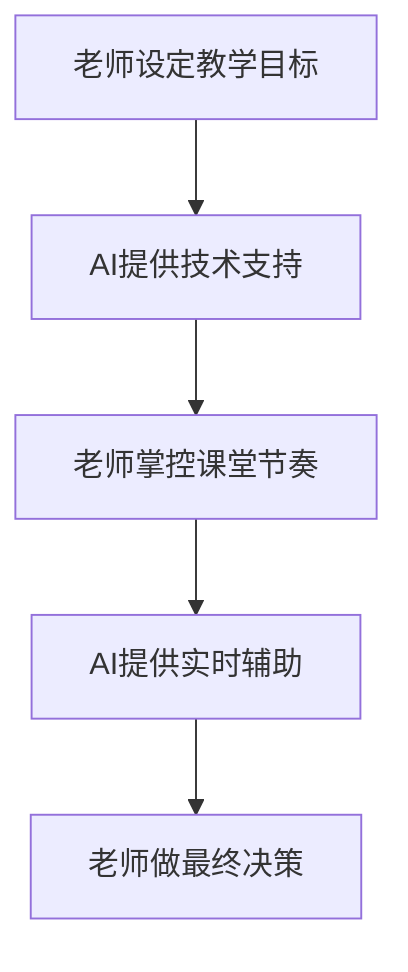
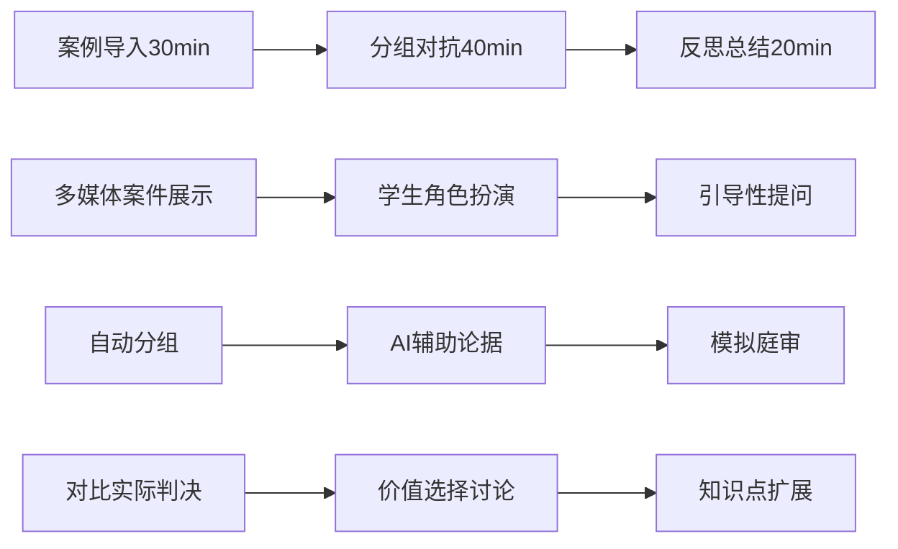

# 苏力教授：六大模块深度分析与服务老师策略

## 对话背景
**时间**：2025年8月21日  
**主题**：法学课堂形式创新与服务老师群体的关键点  
**角色**：苏力教授（基于40年教学经验的分析）

---

## 一、中国法学教师面临的现实困境

### 老师们的核心痛点

#### 1. 备课压力巨大
- 一节90分钟的课，传统备课需要4-6小时
- 找案例、做PPT、设计互动环节，都很耗时
- 每学期都要更新内容，跟上法律变化

#### 2. 学生参与度低
- 传统"满堂灌"模式学生昏昏欲睡
- 提问时经常"一片沉默"
- 难以激发学生的思辨兴趣

#### 3. 教学效果难评估
- 不知道学生真正掌握了什么
- 缺乏有效的反馈机制
- 应试教育与素质教育的矛盾

#### 4. 与实务脱节
- 很多老师缺乏实务经验
- 理论与实践结合困难
- 学生毕业后适应能力差

---

## 二、对现有六大模块的深度分析

### 模块一：案情导入 - 🎯 设计聪明，实施需优化

#### ✅ 亮点分析
- **动态案情推演动画**：比传统PPT有趣多了，学生注意力会集中
- **时间轴可视化**：符合人的认知习惯，复杂案件一目了然
- **溯源到原文**：很实用，老师不用担心学生质疑细节

#### 📋 使用细节预期
```
老师使用场景：
1. 课前5分钟熟悉动画流程
2. 课堂上点击播放，边看边讲解
3. 学生提问时点击跳转原文
```

#### ⚠️ 潜在问题
- 动画制作成本高吗？每个案例都要定制？
- 老师能否暂停在关键节点提问？
- 不同老师的语速不同，播放节奏如何调整？

### 模块二：证据对质 - ⚠️ 需要简化操作

#### ✅ 设计优势
- **双方证据墙对比**：视觉化很好，能激发对抗思维
- **三层信息架构**：信息层次清晰

#### 😰 老师的担心
```
"这个界面会不会太复杂？"
"我要点击多少次才能展示完？"
"学生会不会被复杂界面分散注意力？"
```

#### 💡 改进建议
- 提供"教师模式"：一键按顺序展示所有证据
- 关键证据自动高亮，老师无需手动操作
- 支持语音控制："下一个证据"、"显示冲突点"

### 模块三：争议焦点辩论 - 🔥 最有潜力的环节

#### 🌟 绝妙设计
- **立场快照投票**：这个太好了！能瞬间打破沉默
- **分组辩论**：符合中国学生的参与习惯
- **观点变化追踪**：让学生看到自己思维的变化

#### 🎯 实施细节关键
```
成功要素：
1. 投票要匿名，学生才敢表达真实想法
2. 分组要自动，避免老师费时间安排
3. 计时要明确，保持紧张感
4. 结果要直观，立即显示投票变化
```

#### 😟 老师最担心的
- "如果学生不参与怎么办？"
- "讨论跑偏了怎么控制？"
- "时间把握不好怎么办？"

### 模块四：法官说理展示 - 🤔 需要防止"照本宣科"

#### ⚠️ 风险分析
"剥洋葱"式展开很棒，但要避免老师变成"点击员"

#### 💡 改进思路
- 设置"自动播放模式"，老师只需控制节奏
- 每层展开后自动暂停，等待老师点评
- 提供"跳过"选项，老师可以灵活调整

### 模块五：苏格拉底式提问链 - 💡 核心价值所在

#### 🎯 老师的真实需求
```
"我经常问完问题后，学生不回答，场面很尴尬"
"我不知道下一个问题该怎么问"
"学生回答错了，我不知道怎么引导"
```

#### ✨ 落地建议
- **智能提词器**：根据学生回答，提示老师下一个问题
- **多备选方案**：每个问题提供2-3个不同难度的选择
- **救场机制**：学生沉默时，AI提供"破冰"问题

### 模块六：总结与升华 - 📝 实用但需要个性化

#### 😰 老师的担心
- "这个总结适合我的教学风格吗？"
- "能不能加入我自己的观点？"
- "不同班级需要不同的总结吗？"

#### 💡 解决方案
- 提供多种总结模板供选择
- 支持老师手动编辑和补充
- 记住老师的偏好设置

---

## 三、让老师"愿意用"的核心策略

### 策略一："无痛迁移"设计

#### 兼容现有习惯
```
现状：老师已有PPT、教案、授课习惯
方案：
1. 支持PPT导入，自动转换为互动模块
2. 保留传统授课的所有可能性
3. 让老师感觉是"增强"而非"替换"
```

#### 渐进式功能解锁
- 第一次：只用模块三（争议焦点辩论）
- 熟悉后：逐步解锁其他模块
- 永远不强制使用所有功能

### 策略二："立竿见影"效果

#### 第一次使用就要有惊喜
```
期望效果：
- 学生参与度明显提升
- 课堂氛围更活跃
- 教学时间控制更好
```

#### 数据化成就感
- "今天学生提问比上次多了40%"
- "课堂沉默时间减少60%"
- "学生理解程度提升显著"

### 策略三："权威保持"原则

#### 技术服务于教学


#### 关键设计要点
- AI是助手，老师是主导
- 关键决策权始终在老师手中
- 所有AI建议都可以被一键忽略

---

## 四、针对性的课堂形式建议

### 形式一："三段式互动课堂"



### 形式二："苏格拉底式智能问答"

#### 核心机制
- AI预设多层次问题链条
- 根据学生回答自动调整后续问题
- 老师掌控大方向，AI处理细节互动

#### 实施要点
- 问题要有"陷阱"，让学生主动思辨
- 鼓励"错误"答案，从错误中学习
- 最终让学生自己得出结论

### 形式三："案例工坊模式"

#### 操作流程
```
课前：学生预习 → 课中：深度剖析 → 课后：延伸思考
```

#### 老师角色转变
- 从"讲授者"变为"引导者"
- 控制讨论节奏和深度
- 适时注入理论知识点

---

## 五、服务老师群体的产品设计原则

### 1. "懒人友好"原则
- 操作要简单，学习成本要低
- 一个按钮解决一类问题
- 提供默认模板，支持个性化调整

### 2. "渐进式改变"原则
- 不要颠覆老师的既有习惯
- 从辅助工具开始，逐步深度集成
- 让老师感觉是在"增强"而非"替换"

### 3. "权威保持"原则
- AI是助手，老师是主导
- 关键决策权始终在老师手中
- 技术服务于教学，而非反之

### 4. "成效可见"原则
- 学生参与度的明显提升
- 教学效果的量化反馈
- 同事和学生的积极评价

---

## 六、优先开发的"服务老师"核心功能

### 功能一：智能备课助手
```
输入：判决书
输出：完整教案（包含问题设计、互动环节、扩展材料）
支持：不同教学风格的定制
```

### 功能二：课堂互动管理
- 实时监控学生参与度
- 智能提供"救场"问题
- 自动生成课堂报告

### 功能三：教学效果分析
- 学生理解程度的实时评估
- 知识点掌握情况统计
- 教学改进建议推送

---

## 七、关键实施路径

### 阶段一：验证核心价值（1-2个月）
**重点**：模块三（争议焦点辩论）
- 效果最直观，老师容易看到价值
- 技术实现相对简单
- 成功后再推广其他模块

### 阶段二：解决核心痛点（3-4个月）
**重点**：模块五（苏格拉底式提问链）
- 老师最需要帮助的地方
- 做好这个功能，老师就会产生依赖性
- 可以积累大量教学数据

### 阶段三：形成完整闭环（5-6个月）
**重点**：整合所有模块
- 基于前期使用反馈优化体验
- 形成完整的教学闭环
- 建立可持续的商业模式

---

## 八、核心理念总结

### 苏力教授的金句
> "不是要做最先进的产品，而是要做老师最愿意用的产品"
> 
> "技术服务于教学目标，而不是为了炫技"
> 
> "老师愿意用，才是产品成功的前提"

### 产品成功的三个关键
1. **解决真问题**：聚焦老师的核心痛点
2. **降低门槛**：简单易用，无痛迁移
3. **立即见效**：第一次使用就有明显改善

### 避免的三个陷阱
1. **技术炫酷但实用性差**
2. **功能全面但学习成本高**
3. **理念先进但脱离现实**

---

## 九、待讨论的细节问题

### 技术实现层面
1. 动画制作的标准化程度如何控制？
2. 不同设备（投影仪、一体机、平板）的适配问题
3. 网络不稳定环境下的功能降级方案

### 用户体验层面
1. 老师培训的最优方式是什么？
2. 如何处理老师的个性化需求差异？
3. 学生端和教师端的界面如何协调？

### 商业模式层面
1. 免费试用期多长合适？
2. 如何建立教师社区和口碑传播？
3. 与传统教学软件的竞争策略

---

## 十、下步深入讨论方向

### 即将讨论的核心问题
1. **模块三的具体交互设计**：投票、分组、计时的技术细节
2. **模块五的问题库建设**：如何构建高质量的提问链条
3. **老师培训体系**：如何让老师快速上手并产生依赖

### 需要验证的假设
1. 老师是否真的愿意改变传统教学方式？
2. 学生参与度提升是否等于教学效果提升？
3. 技术工具是否能真正减轻老师负担？

---

*记录于2025年8月21日，基于苏力教授对六大教学模块的深度分析和对服务老师群体的战略思考*